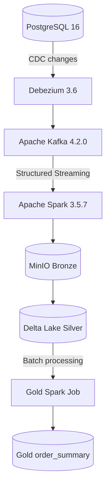

# E-commerce Data Platform

A local end-to-end data engineering portfolio demonstrating **Change Data Capture (CDC), event streaming, PySpark processing, and a Bronze–Silver–Gold data lake architecture**.

Built with Docker Compose using PostgreSQL, Debezium, Apache Kafka, Apache Spark, MinIO, and Delta Lake.


---

## Architecture



---
## Project Goals

This project demonstrates a practical data platform capable of:

* Capturing transactional database changes using CDC
* Publishing CDC events through Apache Kafka
* Processing streaming data with Apache Spark
* Storing data in an S3-compatible object store
* Implementing a Bronze / Silver / Gold data architecture
* Maintaining Silver datasets as Delta Lake tables
* Building an analytical Gold dataset
* Handling INSERT, UPDATE, and DELETE events
* Demonstrating CDC-to-data-lake data lineage
* Running the complete environment locally with Docker Compose

---

## Technology Stack

| Component               | Technology         |
| ----------------------- | ------------------ |
| Source Database         | PostgreSQL 16      |
| CDC                     | Debezium 3.6       |
| Streaming               | Apache Kafka 4.2.0 |
| Processing              | Apache Spark 3.5.7 |
| Object Storage          | MinIO              |
| Table Format            | Delta Lake         |
| Containerization        | Docker Compose     |
| Development Environment | macOS              |

---

## Data Flow

The current implemented pipeline follows this flow:

```text
PostgreSQL
    │
    │ INSERT / UPDATE / DELETE
    ▼
Debezium
    │
    │ CDC Event
    ▼
Kafka
    │
    │ ecommerce.<schema>.<table>
    ▼
Spark Structured Streaming
    │
    ▼
MinIO
    │
    ├── Bronze
    │
    ├── Silver
    │
    └── Gold
         │
         ▼
    Analytical Dataset
```

---

## Source Database

PostgreSQL is used as the transactional source system.

The database contains the following main e-commerce entities:

```text
customers
products
orders
order_items
payments
inventory
```

PostgreSQL is configured with logical replication so that database changes can be captured by Debezium.

---

## Change Data Capture

Debezium captures changes from PostgreSQL and publishes them to Kafka.

The connector uses the PostgreSQL `pgoutput` logical decoding plugin.

The main CDC operations are:

```text
c = Create / Insert
u = Update
d = Delete
r = Read / Snapshot
```

The connector captures the following tables:

```text
public.customers
public.products
public.orders
public.order_items
public.payments
public.inventory
```

CDC configuration:

```text
debezium-connector.json
```

### CDC Flow

Example:

```text
PostgreSQL UPDATE
       │
       ▼
    Debezium
       │
       ▼
 Kafka CDC Event
       │
       ▼
 Spark Streaming
       │
       ▼
    Bronze
```

---

## Kafka

Apache Kafka is used as the event streaming platform between PostgreSQL/Debezium and Spark.

The project uses the following topic naming convention:

```text
ecommerce.<schema>.<table>
```

Examples:

```text
ecommerce.public.customers
ecommerce.public.products
ecommerce.public.orders
ecommerce.public.order_items
ecommerce.public.payments
ecommerce.public.inventory
```

A Debezium heartbeat topic is also used:

```text
__debezium-heartbeat.ecommerce
```

Kafka is configured with three partitions by default for the local development environment.

---

## Spark Structured Streaming

Apache Spark processes CDC events coming from the data lake and Kafka-derived Bronze datasets.

The Spark processing layer handles:

* Parsing Debezium CDC payloads
* Extracting `before` and `after` records
* Identifying CDC operations
* Selecting the latest event for a record
* Handling INSERT / UPDATE / DELETE
* Upserting records into Delta Lake
* Removing deleted records
* Building analytical Gold datasets

Spark jobs are located under:

```text
spark/jobs/
```

---

# Medallion Architecture

The data lake follows a three-layer architecture:

```text
Bronze
   │
   ▼
Silver
   │
   ▼
Gold
```

Each layer has a different responsibility.

---

## Bronze Layer

Bronze contains the raw or lightly processed CDC data produced from the streaming pipeline.

Example storage:

```text
s3a://bronze/customers
s3a://bronze/products
s3a://bronze/orders
...
```

Bronze records retain CDC-related metadata such as:

* `before`
* `after`
* `operation`
* event timestamp
* Kafka topic
* partition
* offset
* Kafka timestamp
* processing timestamp

This layer provides a raw processing point that can be used for debugging, replay, and downstream transformations.

---

## Silver Layer

Silver contains cleaned and current-state datasets derived from Bronze CDC events.

The current Silver implementation processes:

```text
customers
products
inventory
order_items
orders
payments
```

The Silver pipeline:

1. Reads Bronze data
2. Parses the `before` and `after` CDC payloads
3. Determines the record key
4. Identifies the latest event for each record
5. Applies DELETE operations
6. Applies INSERT / UPDATE / READ operations
7. Maintains the resulting tables as Delta Lake datasets

Example:

```text
s3a://silver/customers
s3a://silver/products
s3a://silver/orders
...
```

The implementation uses Delta Lake `MERGE` operations for upsert processing.

---

## Gold Layer

Gold contains business-oriented analytical datasets.

The current Gold implementation builds:

```text
gold/order_summary
```

The dataset combines information from:

```text
Orders
   +
Customers
   +
Payments
   +
Order Items
```

The resulting analytical dataset includes information such as:

* Order ID
* Customer ID
* Customer name
* Customer email
* Customer location
* Order date
* Order status
* Order amount
* Payment method
* Payment status
* Payment amount
* Payment timestamp
* Item count
* Unique product count
* Last update timestamp

The Gold dataset is stored using Delta Lake:

```text
s3a://gold/order_summary
```

Example:

```python
gold = (
    spark.read
    .format("delta")
    .load("s3a://gold/order_summary")
)
```

---

## Delta Lake

Delta Lake is used as the table format for the Silver and Gold layers.

The project uses Delta Lake to support:

* ACID-style table operations
* MERGE / upsert processing
* DELETE operations
* Structured analytical datasets
* Reliable table storage on object storage

The Silver pipeline uses Delta Lake `MERGE` operations to apply CDC changes.

---

## Object Storage

MinIO provides S3-compatible object storage for the local data lake.

The logical storage structure is:

```text
MinIO
│
├── bronze/
│
├── silver/
│
└── gold/
```

Spark accesses MinIO using the S3A filesystem.

---

## Docker Environment

The currently implemented Docker Compose environment contains:

```text
PostgreSQL
Kafka
Debezium
MinIO
Spark
```

The main configuration is located in:

```text
docker-compose.yml
```

Start the environment:

```bash
docker compose up -d
```

Check running containers:

```bash
docker ps
```

Stop the environment:

```bash
docker compose down
```

---

## Project Structure

The repository currently contains:

```text
ecommerce-data-platform/
│
├── debezium/
│   └── connector-postgres.json
│
├── docs/
│   └── 01-architecture.md
│
├── postgres/
│   └── init/
│       └── 01_schema.sql
│
├── spark/
│   └── jobs/
│       ├── bronze_all.py
│       ├── bronze_customers.py
│       ├── customers_bronze.py
│       ├── customers_silver.py
│       ├── gold_order_summary.py
│       └── silver_all.py
│
├── .gitignore
├── README.md
├── debezium-connector.json
└── docker-compose.yml
```

---

# CDC Testing

The CDC pipeline can be tested by modifying data directly in PostgreSQL.

## Insert

Example:

```sql
INSERT INTO customers (
    first_name,
    last_name,
    email,
    city,
    country
)
VALUES (
    'Test',
    'Spark',
    'test.spark@example.com',
    'Jakarta',
    'Indonesia'
);
```

Expected flow:

```text
PostgreSQL INSERT
       ↓
   Debezium
       ↓
     Kafka
       ↓
     Spark
       ↓
    Bronze
```

---

## Update

Example:

```sql
UPDATE customers
SET
    first_name = 'Updated',
    city = 'Bandung',
    updated_at = CURRENT_TIMESTAMP
WHERE customer_id = 4;
```

Expected Debezium operation:

```text
op = u
```

---

## Delete

Example:

```sql
DELETE FROM customers
WHERE customer_id = 4;
```

Expected Debezium operation:

```text
op = d
```

These operations demonstrate the complete CDC lifecycle:

```text
CREATE → UPDATE → DELETE
```

---

# Data Lineage

A simplified lineage for a customer record is:

```text
PostgreSQL
customers
    │
    ▼
Debezium
    │
    ▼
Kafka
ecommerce.public.customers
    │
    ▼
Spark
    │
    ▼
MinIO
bronze/customers
    │
    ▼
Spark Silver Processing
    │
    ▼
silver/customers
```

For analytical data:

```text
silver/orders
       │
silver/customers
       │
silver/payments
       │
silver/order_items
       │
       ▼
Gold Transformation
       │
       ▼
gold/order_summary
```

---

# Current Implementation Status

| Component                      | Status        |
| ------------------------------ | ------------- |
| PostgreSQL                     | ✅ Implemented |
| PostgreSQL Logical Replication | ✅ Implemented |
| Debezium CDC                   | ✅ Implemented |
| Kafka                          | ✅ Implemented |
| Kafka CDC Topics               | ✅ Implemented |
| Spark Structured Streaming     | ✅ Implemented |
| MinIO Object Storage           | ✅ Implemented |
| Bronze Layer                   | ✅ Implemented |
| Silver Layer                   | ✅ Implemented |
| Delta Lake                     | ✅ Implemented |
| Gold `order_summary`           | ✅ Implemented |
| Data Quality Framework         | ⏳ Planned     |
| Airflow Orchestration          | ⏳ Planned     |
| dbt / Dataform                 | ⏳ Planned     |
| DuckDB Analytics               | ⏳ Planned     |
| Metabase Dashboard             | ⏳ Planned     |
| Monitoring / Observability     | ⏳ Planned     |
| CI/CD                          | ⏳ Planned     |

---

## Latest Local Validation

The following results were verified in the local Docker environment.

| Dataset | Observed records |
|---|---:|
| Silver customers | 6 |
| Silver products | 5 |
| Silver inventory | 5 |
| Silver order items | 8 |
| Silver orders | 5 |
| Silver payments | 5 |
| Gold order summary | 5 |

Validation included reading the Silver and Gold Delta tables from MinIO,
checking record counts, and verifying that a customer update captured
through CDC was reflected in Silver and in a subsequent Gold batch run.

### Processing modes

- **Bronze:** Spark Structured Streaming consumes CDC events from Kafka and writes Parquet to MinIO.
- **Silver:** Spark Structured Streaming processes Bronze data and applies CDC changes to Delta tables.
- **Gold:** A batch Spark job builds the analytical `order_summary` dataset from Silver data. Rerun the Gold job after Silver changes to refresh the summary.

These results describe a tested local development state, not a production
scale or performance guarantee. Broader failure recovery, automated data
quality checks, monitoring, and integration testing remain future work.

# Getting Started

## 1. Clone the repository

```bash
git clone https://github.com/anggacega-lang/ecommerce-data-platform.git
cd ecommerce-data-platform
```

## 2. Create environment configuration

Create a local `.env` file containing the required PostgreSQL and MinIO configuration.

The `.env` file should **not** be committed to Git.

Example variables:

```text
POSTGRES_DB=
POSTGRES_USER=
POSTGRES_PASSWORD=

MINIO_ROOT_USER=
MINIO_ROOT_PASSWORD=
```

## 3. Start the platform

```bash
docker compose up -d
```

## 4. Verify containers

```bash
docker ps
```

## 5. Check Kafka topics

```bash
docker exec -it ecommerce-kafka \
/opt/kafka/bin/kafka-topics.sh \
--bootstrap-server localhost:9092 \
--list
```

## 6. Check Debezium

```bash
curl http://localhost:8083/connectors
```

---

# Future Improvements

The next stages of the project are planned to include:

* Automated data quality checks
* Airflow orchestration
* Additional Gold analytical models
* dbt / Dataform transformations
* DuckDB analytical workflows
* Metabase dashboards
* Pipeline monitoring and alerting
* Automated testing
* CI/CD
* More detailed component documentation

---

# Learning Objectives

This project is designed to demonstrate practical understanding of:

* Data Engineering
* Change Data Capture
* Event-driven architecture
* Apache Kafka
* Apache Spark
* Structured Streaming
* Data Lake architecture
* Medallion architecture
* Delta Lake
* S3-compatible object storage
* Data transformation
* Data modeling
* Docker-based development

---

# Documentation

Detailed architecture documentation:

```text
docs/01-architecture.md
```

The documentation covers:

* End-to-end architecture
* Data flow
* CDC
* Kafka
* Spark
* MinIO
* Bronze / Silver / Gold
* Delta Lake
* Data lineage
* Architecture decisions

---

# Author

**Angga Cega**

Data engineering portfolio focused on building local data pipelines and exploring:

- Python and SQL
- PySpark and Apache Kafka
- CDC and data lake architecture
- GCP and BigQuery

GitHub: [@anggacega-lang](https://github.com/anggacega-lang)

## License

This project is created as a personal learning and portfolio project.
